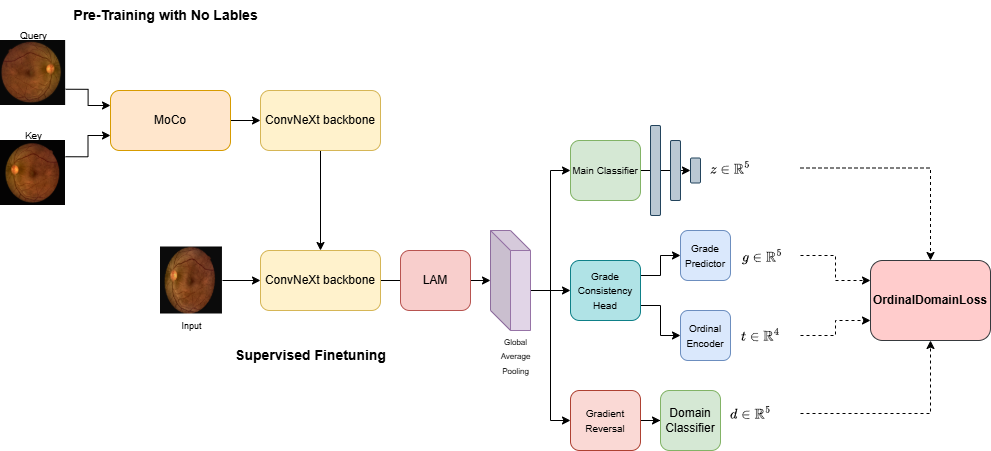
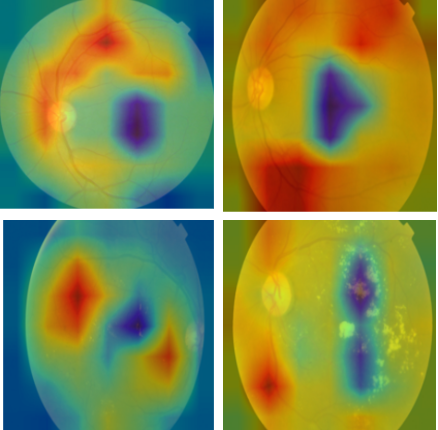
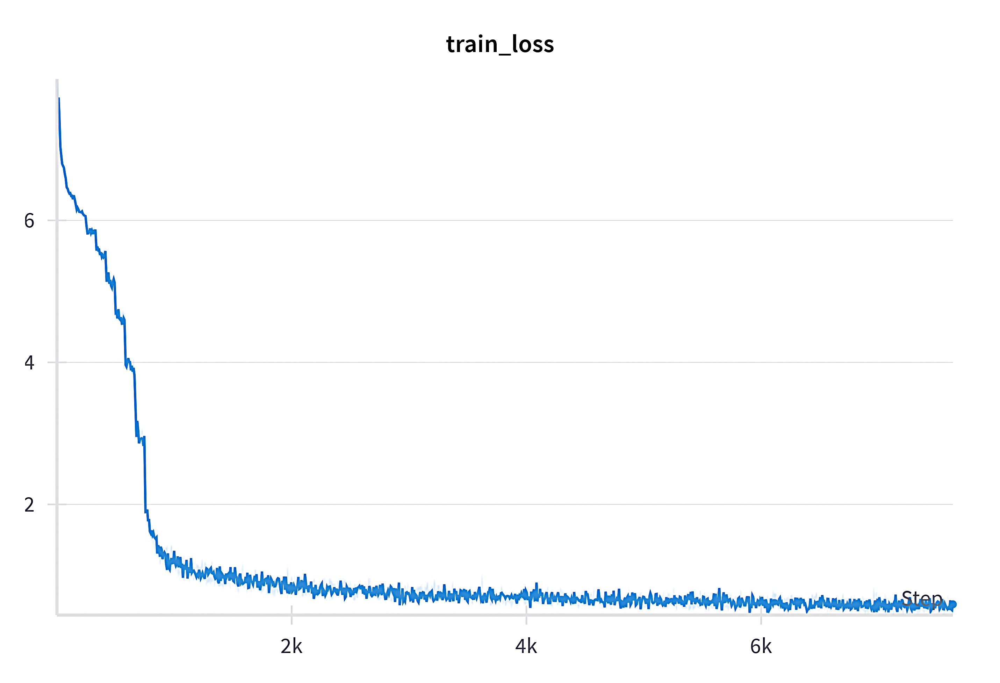
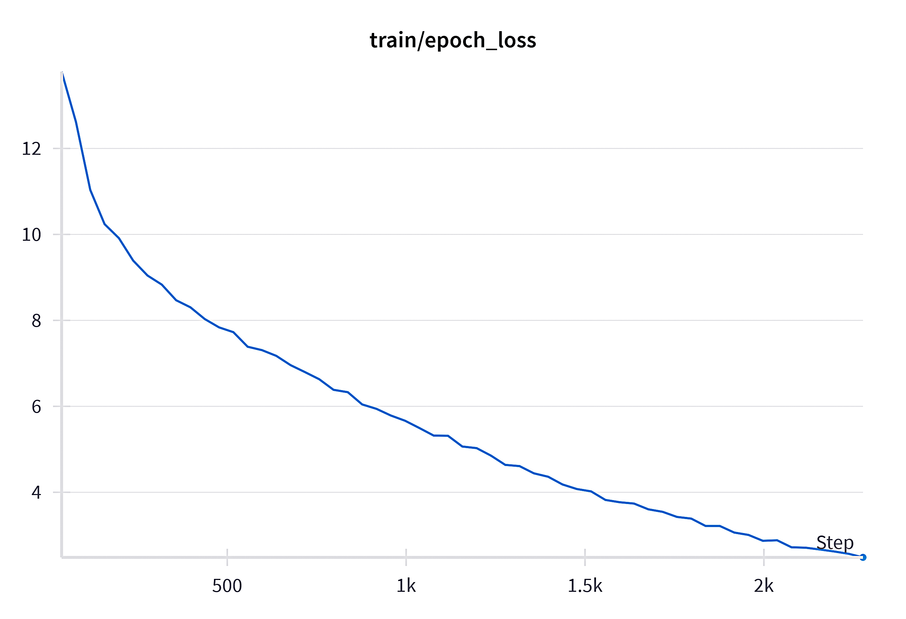

# RetinaSys: A Generalizable Real-Time Diabetic Retinopathy Detection System

This repository contains the official PyTorch implementation for the paper: **"RetinaSys: Generalizable Real-Time Diabetic Retinopathy Detection System"**.

Diabetic Retinopathy (DR) is a leading cause of preventable blindness worldwide, yet screening procedures are often inefficient and subject to the availability of trained ophthalmologists. While deep learning has shown promise, many models struggle with real-world clinical adoption due to challenges in adaptability, interpretability, and deployment. RetinaSys is an innovative framework designed to bridge this gap, focusing on **strong generalization** across diverse datasets, **real-time performance** on standard CPU hardware, and **clinical interpretability** through Explainable AI (XAI).

## 🌟 Key Features

- **Self-Supervised Pre-training**: RetinaSys leverages Momentum Contrast (MoCo v3) to pre-train a modern ConvNeXt backbone on a wide range of unlabeled fundus images. This approach allows the model to learn robust and generalizable visual features—such as the intricate network of retinal blood vessels and optic disc structures—without requiring costly and time-consuming manual annotations. This foundational understanding is critical for high performance in the downstream diagnostic task.
    
- **Multi-Task Fine-tuning**: After pre-training, the model is fine-tuned using a unique multi-task paradigm that simultaneously optimizes for three distinct objectives, ensuring both accuracy and reliability:
    
    - A **Lesion-Attention Module (LAM)**, inspired by CBAM, mimics a clinician's diagnostic process by dynamically focusing the model's attention on clinically relevant features like microaneurysms, hemorrhages, and exudates.
        
    - A **Grade Consistency Head** enforces the natural ordinal relationship of DR severity (e.g., Mild DR is less severe than Moderate DR). This significantly reduces the risk of critical misclassifications, such as predicting a mild case as severe, which is crucial for patient safety and trust.
        
    - A **Domain-Adversarial Module** with a gradient reversal layer actively encourages the model to learn features that are invariant to dataset-specific biases (e.g., differences in camera models, lighting conditions, or patient ethnicity), dramatically improving its generalization to unseen clinical environments.
        
- **Explainable AI (XAI)**: To address the "black box" problem in medical AI, RetinaSys integrates a comprehensive suite of XAI techniques. These tools—including Attention Maps, Integrated Gradients, SHAP, and Monte Carlo Dropout for uncertainty estimation—provide transparent, human-interpretable insights into the model's decision-making process, fostering trust and collaboration between the AI system and clinicians.
    
- **Real-Time CPU Deployment**: A major barrier to AI adoption is the need for expensive, specialized hardware. RetinaSys is optimized using the OpenVINO toolkit for efficient, real-time inference on standard Intel CPUs. Through techniques like FP16 precision reduction and INT8 quantization, the model achieves a significant reduction in memory footprint and computational load with minimal impact on diagnostic accuracy, making it a practical and scalable solution for deployment in resource-constrained clinical settings.
    

## 🏗️ System Architecture

The RetinaSys pipeline is a carefully designed, two-stage process. The first stage builds a strong visual foundation through self-supervised learning, and the second stage specializes this knowledge for the clinical task of DR grading while ensuring robustness and fairness. This modular design allows for independent improvements to each component.


    

## 👁️ Diabetic Retinopathy Grades

The system is trained to classify retinal fundus images into five distinct grades of severity, following established clinical standards, from a healthy retina (No DR) to the most advanced stage (Proliferative DR).



    

## 🚀 Getting Started

### 1. Prerequisites

- Python 3.9+
    
- PyTorch (latest version recommended)
    
- OpenCV, Scikit-learn, Timm, PyYAML
    
- OpenVINO Toolkit
    
- NVIDIA GPU with CUDA for training (recommended)
    
- Intel CPU for optimized deployment
    

### 2. Installation

First, clone the repository to your local machine:

```
git clone https://github.com/your-username/retinasys-diabetic-retinopathy.git
cd retinasys-diabetic-retinopathy
```

Next, it is highly recommended to create a dedicated virtual environment to manage dependencies and avoid conflicts:

```
python -m venv venv
source venv/bin/activate  # On Windows, use `venv\Scripts\activate`
pip install -r requirements.txt
```

### 3. Dataset Preparation

This project's robustness comes from its training on a diverse collection of public datasets (EyePACS, DDR, APTOS, IDRID, MESSIDOR-2, etc.). Please download these datasets from their original sources. For compatibility with our data loaders, structure them as follows:

```
data/
├── eyepacs/
│   ├── train/
│   └── test/
├── ddr/
│   ├── train/
│   └── test/
└── ... (other datasets)
```

Once the data is correctly organized, run the provided preprocessing script. This will handle tasks like image resizing, cleaning, and creating the necessary file lists for training and evaluation.

```
python scripts/1_preprocess_data.py --data_dir data/
```


## 📊 Results

The model achieves strong performance across multiple evaluation criteria. It maintains high specificity (correctly identifying healthy patients) and demonstrates excellent ordinal agreement with ground-truth grades, as measured by the Quadratic Weighted Kappa (QWK). A high QWK score is clinically significant as it indicates that when the model does make an error, it is typically between adjacent grades (e.g., Mild vs. Moderate), which is far less severe than a major misdiagnosis.

#### Training & Validation Curves


    

## 🧠 Explainable AI (XAI) Analysis

A correct prediction is useful, but an explainable one is trustworthy. To build clinical trust and facilitate model debugging, RetinaSys provides clear visual explanations for its predictions. These visualizations highlight the specific pathological features (e.g., microaneurysms, hard exudates) that drive the model's diagnostic reasoning, creating a powerful feedback loop for clinicians.


    
